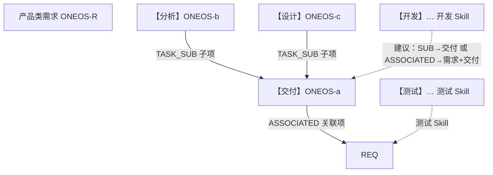

# YunxiaoPMapp 实现原理说明

> 供**开发部门**设计 / 制作「开发侧 Skill」（暂称 **YunxiaoDevapp**）时对齐契约。  
> 本文描述产品侧 Skill **YunxiaoPMapp** 的模型、边界、数据契约与交棒接口；**不是**对 `yunxiao-requirement-lifecycle` 的兼容说明。  
> 技能包：https://github.com/15810879921-coder/oneos-pm-skills · `skills/YunxiaoPMapp/`  
> 文档版本：2026-07-24

---

## 1. 为什么拆成两个 Skill

| | YunxiaoPMapp（产品） | 开发 Skill（待建） |
|---|---|---|
| 职责 | 需求从「待处理」到「待开发」交棒 | 从「待开发」到开发完成 / 提测前 |
| 任务类型 | 【交付】【分析】【设计】 | 【开发】（可多条）、可选挂仓库/分支 |
| 负责人交接 | 交棒时【交付】→ **何斐** | 拆【开发】子任务并指派研发 |
| 明确不做 | 建【开发】/【测试】、开分支、提测 | 不建【分析】/【设计】、不改 AutoRDO 段 |

**硬规则：** 两个 Skill **禁止互相 include / fork 全文**；只认本文第 6 章「交棒契约」。产品会话与开发会话不要同时挂载旧 `yunxiao-requirement-lifecycle`，避免双建任务树。

---

## 2. 核心真相源（必须先统一）

```text
需求状态          = 阶段看板唯一真相（分析中 / 设计中 / 待开发 …）
【交付】任务       = 每需求最多 1 条「交付容器」
【分析】【设计】   = 【交付】下的阶段子项（产品侧建）
【开发】【测试】   = 开发 / 测试 Skill 建（产品侧永不创建）
查重 / 复用        = 只认云效任务编号 ONEOS-xx，禁止按标题
```

### 2.1 关系模型（云效）



| 关系 | 谁写 | 验收 |
|---|---|---|
| `ASSOCIATED` | **仅【交付】→ 需求** | 交付详情「关联项」可见需求 |
| `TASK_SUB` | 【分析】/【设计】→【交付】 | 交付详情「子项」可见阶段任务 |
| （开发侧建议） | 【开发】→【交付】或需求 | 由开发 Skill 自定，但须可编号查重 |

**踩坑（已复现）：** 对分析/设计只写 `parentIdentifier` + `ASSOCIATED→需求`，交付「子项」会为空。正确：create 时 `createWorkitemRelationInfo=TASK_SUB` + `parent`/`parentIdentifier`=交付。同一 create **只能**带一条关系，ASSOCIATED 与 TASK_SUB 互斥。

### 2.2 标题只是展示

- 形式：`【交付】`/`【分析】`/`【设计】` + 需求标题  
- **不参与查重**；改标题不影响幂等  
- 开发侧【开发】标题建议 `【开发】` + 范围简述，同样**只认编号**

---

## 3. 编号权威源

需求描述固定区块（机器可解析）：

```markdown
## 工作项编号（系统）
- 交付：ONEOS-a
- 分析：ONEOS-b（无则写无）
- 设计：ONEOS-c（无则写无）
```

| 规则 | 说明 |
|---|---|
| 新建后立即 PATCH | 只改本区块，不动 AutoRDO / AutoPRD |
| 操作顺序 | 口令显式编号 > 读本区块 > ASSOCIATED/SUB 反查 |
| 冲突 | 停下人工；**禁止按标题猜** |
| 多交付编号 | 停止并列号请人合并 |

**开发 Skill 入口建议：** 口令必须带 `需求=ONEOS-R` + `交付任务=ONEOS-a`；缺则读本区块；仍无则询问。

---

## 4. 需求描述双段（产品写 · 开发只读）

```markdown
## 原始诉求（AutoRDO）
（聊天/录音清洗稿；设计完成也不删）

## 产品说明（AutoPRD）
（设计完成才灌满；含对象存储预览链接）

## 工作项编号（系统）
- 交付 / 分析 / 设计
```

| 段 | 谁写 | 开发侧用法 |
|---|---|---|
| AutoRDO | `$AutoRDO` → 产品记需求时 | 占位交棒时**唯一可信**业务原文 |
| AutoPRD | `$oneos-autoprd` → 设计完成时 | 正式需求说明；缺则有权要求产品补设计完成 |
| 编号区块 | YunxiaoPMapp | 定位交付树 |

**【交付】描述：** 设计完成前固定占位文案 `等待设计任务完成后自动填入`；设计完成后替换为 AutoPRD 正文。  
**允许占位交棒**，但产品回报必须标红风险；开发 Skill 应检测占位并提示「材料不齐，可凭 AutoRDO 开工或退回补设计」。

对象存储预览 URL 形态：`{baseUrl}/{prototype-id}/index.html`（禁止加 `prototypes/` 前缀、禁止去掉 `index.html`）。

---

## 5. 产品侧阶段状态机（0→5）

```text
0 创建需求（待处理）  ─AutoRDO→  仅需求，不建任务
1 受理确认（已确认）          仍不建任务
2 分析中                     建【交付】+【分析】
3 设计中                     建【设计】；收口【分析】计划完成
4 设计完成                   收口【设计】；AutoPRD+附件；灌【交付】描述
5 待开发交棒 ★               需求→待开发；【交付】负责人→何斐
                            ★ = YunxiaoPMapp 终点 / 开发 Skill 起点
```

### 5.1 各步要点（开发需知道的副作用）

| 步骤 | 需求状态 | 任务侧关键动作 |
|---|---|---|
| 2 分析中 | 分析中 | 新建【交付】ASSOCIATED→需求；描述=占位；计划开始仅空写当日且**此后不可改**；新建【分析】TASK_SUB→交付 |
| 3 设计中 | 设计中 | 新建【设计】；【分析】计划完成=当日 + 阶段日历工时 |
| 4 设计完成 | 设计完成 | 【设计】完成态；需求+交付挂 ZIP/截图；交付描述换正式说明 |
| 5 交棒 | **待开发** | **只改交付负责人→何斐**；不新建分析/设计；不写交付计划完成 |

### 5.2 两条旁路（仍交到同一终点）

| 路径 | 前提 | 行为 |
|---|---|---|
| **无单快轨** | 尚无分析路径 / 明确跳过分析 | 待开发 + 新建交付+设计（设计当日收口）；**不建分析**；默认可不跑 AutoPRD |
| **编号直推** | 已有分析/设计**编号** | 收口空计划完成 → 待开发 + 交付交棒何斐；不新建冗余单 |

---

## 6. 交棒契约（开发 Skill 必须实现）

### 6.1 入口条件（产品已完成）

```text
需求状态 = 待开发
【交付】任务编号 = ONEOS-a（唯一）
【交付】负责人 = 何斐
【交付】ASSOCIATED → 该需求
可选：分析/设计编号在「工作项编号（系统）」中
```

### 6.2 开发 Skill 建议入口口令

```text
接手开发：需求=ONEOS-R；交付任务=ONEOS-a
拆分开发：交付任务=ONEOS-a；范围=前端|后端|…；负责人=…
开始开发：开发任务=ONEOS-d
开发完成：开发任务=ONEOS-d
```

### 6.3 开发 Skill 建议职责边界

| 应做 | 不应做 |
|---|---|
| 在【交付】下建一条或多条【开发】（编号幂等） | 再建【分析】/【设计】或第二套【交付】 |
| 正式关联：建议 SUB→交付，或同时 ASSOCIATED→需求 | 只按标题「【开发】xxx」查重 |
| 挂仓库 / 分支 / MR（按你们 Codeup 规范） | 覆盖需求 AutoRDO 段 |
| 改【开发】状态与负责人 | 擅自把需求从待开发退回（除非产品授权回退口令） |
| 检测交付描述是否仍为占位并提示 | 假装 AutoPRD 已齐全 |
| 全部【开发】完成后通知测试 Skill / 建【测试】 | 在产品 Skill 会话里混跑 |

### 6.4 共享常量（可引用，勿整包加载）

路径均在 `skills/YunxiaoPMapp/assets/`：

| 文件 | 内容 |
|---|---|
| `runtime-ids.json` | 项目 spaceId、何斐 ID、工作项类型、状态 transit、字段 79/80 |
| `cn-workday-calendar.json` | 法定节假日 / 调休（阶段日历工时） |

开发侧可复制一份到自己的 `assets/`，或只读引用短路径；**不要**把 YunxiaoPMapp 的 references 全文 include 进开发 Skill。

---

## 7. 计划时间与「阶段日历工时」

产品侧口径（开发侧若写计划时间建议对齐语义）：

| 对象 | 计划开始 | 计划完成 | 预计工时 |
|---|---|---|---|
| 【交付】 | 首次分析中空则写当日，**永不覆盖** | 产品侧不写（留给上线） | 一般不推全周期 |
| 【分析】【设计】 | 创建时空则写当日，**永不覆盖** | 阶段收口日 | `工作日×8` |

```text
预计工时 = 阶段日历工时（Lead Time）≠ 人力投入人天
算法：起止日含首尾，扣周末与法定假，计入调休补班；×8 小时
禁止：（结束−开始+1）×8 的自然日算法
```

脚注固定：`【系统】预计工时=阶段日历工时（工作日×8），非人力投入预估`  
脚本：`scripts/workday_hours.py`

**建议：** 开发 Skill 若给【开发】写预计工时，在文档中明确是「人力投入预估」还是「阶段日历工时」，避免与产品侧混称。

---

## 8. Agent 运行时原理（制作 Skill 时照抄模式）

### 8.1 Plan 门禁

凡写云效：`SwitchMode → plan` → 用户确认 → 一口气 apply → 一次校验回报。  
禁止用「参数已齐 / 速度路径」跳过 Plan。

### 8.2 模块化路由

`SKILL.md` 只做路由与门禁；细则在 `references/*.md`；常量在 `assets/`；脚本在 `scripts/`。  
外置能力（AutoRDO、AutoPRD）**调用对方 Skill**，不内嵌对方全文。

### 8.3 幂等

```text
幂等键 = 项目 + 需求编号 + 任务类型角色（交付/分析/设计/开发…）+ 已登记任务编号
命中编号 → 复用并补缺字段；禁止新建第二条同角色主容器（交付唯一）
```

### 8.4 验收与回报

每次 apply 后自检（产品侧清单见 `references/acceptance.md`）。开发侧建议至少回报：

```text
【YunxiaoDevapp】
需求：ONEOS-R | 状态=待开发|开发中|…
交付：ONEOS-a | 负责人=…
开发：ONEOS-d1, ONEOS-d2 | …
仓库/分支：…
下一步：…
```

### 8.5 已验证写路径（可复用思路）

| 动作 | 约定（见 live-api.md） |
|---|---|
| 改状态 | `POST …/status/transit`（勿用错误 updateStatus） |
| 改负责人 | `PATCH …/{id}` + `propertyKey=assignedTo` |
| 建单关系 | create 带 `createWorkitemRelationInfo` |
| 极速复测 | `scripts/live_create_fast.py`（可参考，开发侧另写自己的脚本） |

---

## 9. 回退最小集（开发需配合）

| 场景 | 产品侧规则 | 开发侧注意 |
|---|---|---|
| 待开发 → 退回设计中 | 需求回退；交付负责人可改回产品；**交付计划开始不改**；重做设计则**新开设计编号** | 已建【开发】是否取消 / 暂停由开发 Skill 定义；勿静默删编号 |
| 设计完成后需求大变 | Plan 问是否回退；更新 AutoPRD；AutoRDO 保留+变更纪要 | 勿覆盖 AutoRDO |
| 取消需求 | 任务标取消；不删编号区块 | 同步取消未完成【开发】 |

---

## 10. 建议的「YunxiaoDevapp」目录骨架

```text
YunxiaoDevapp/
├── SKILL.md                 # 门禁 + 路由 + 边界（引用本文契约，不 include PMapp）
├── assets/
│   └── runtime-ids.json     # 可从 PMapp 复制/裁剪
├── references/
│   ├── model.md             # 【开发】与交付/需求的关系约定
│   ├── handoff-intake.md     # 认交付编号 + 占位检测
│   ├── split-dev-tasks.md   # 拆前端/后端多【开发】
│   ├── codeup.md            # 分支 / MR / 关联
│   ├── commands.md          # 口令面
│   └── acceptance.md
└── scripts/                 # 可选极速 API
```

`SKILL.md` description 建议写明：触发词「接手开发 / 拆分开发 / 开始开发」；**Does NOT create 【分析】/【设计】**；入口条件需求=待开发。

---

## 11. 对照检查表（开发 Skill 评审用）

- [ ] 是否只认「需求编号 + 交付任务编号」，禁止标题查重  
- [ ] 是否拒绝创建第二套【交付】或【分析】【设计】  
- [ ] 占位交棒时是否提示风险且不假装 PRD 齐全  
- [ ] 【开发】是否可编号幂等、可挂到交付树  
- [ ] 是否与 YunxiaoPMapp **会话隔离**（不同 Skill、不同口令）  
- [ ] 计划开始字段是否遵守「已有值不覆盖」（若沿用同一字段）  
- [ ] 提测 / 【测试】是否交给测试 Skill，本包边界清晰  

---

## 12. 相关文档索引

| 主题 | 路径（仓库内） |
|---|---|
| Skill 入口 | `skills/YunxiaoPMapp/SKILL.md` |
| 交付树模型 | `skills/YunxiaoPMapp/references/model.md` |
| 交棒契约 | `skills/YunxiaoPMapp/references/handoff-contract.md` |
| 标准路径 0–5 | `skills/YunxiaoPMapp/references/stage-flow.md` |
| 交棒门禁 / 回退 | `skills/YunxiaoPMapp/references/handoff-and-rollback.md` |
| 描述双段 | `skills/YunxiaoPMapp/references/description-split.md` |
| 编号区块 | `skills/YunxiaoPMapp/references/workitem-ids.md` |
| 快轨 / 编号直推 | `references/fast-track.md` · `number-push.md` |
| 工时算法 | `references/work-hours.md` |
| 实写 API | `references/live-api.md` |

安装产品 Skill：

```bash
npx skills add 15810879921-coder/oneos-pm-skills --skill YunxiaoPMapp -a cursor -g -y
```
