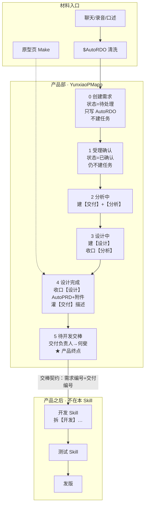
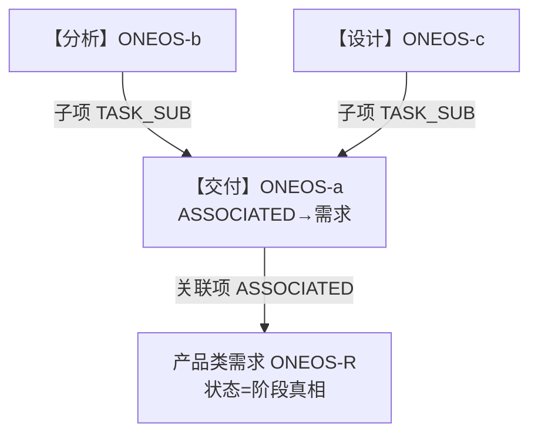
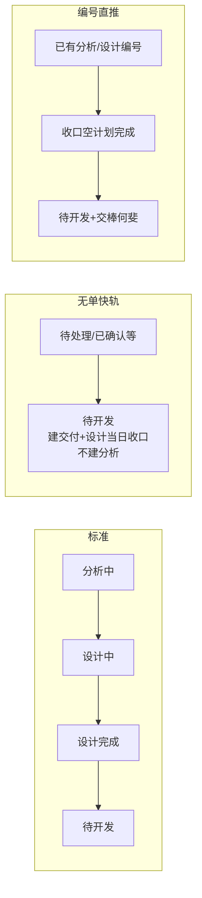
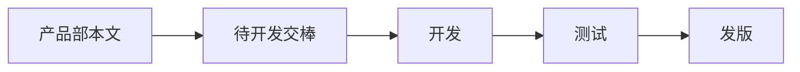

# 产品部流转：YunxiaoPMapp（到交棒为止）

> 用途：先把**产品部**在云效上的工作流转说清楚；开发 / 测试 / 发版不在本 Skill 内，仅在文末标出交接点。  
> 依据：`references/stage-flow.md` · `model.md` · `fast-track.md` · `handoff-contract.md`  
> 日期：2026-07-24

---

## 1. 产品部管到哪里

```text
产品部（YunxiaoPMapp）终点 = 需求状态「待开发」+【交付】负责人「何斐」
之后 = 请技术经理使用开发 Skill（不建【开发】/【测试】）
```

| 谁 | 做什么 | 不做什么 |
|---|---|---|
| 产品 / YunxiaoPMapp | 建需求、打标签、建【交付】【分析】【设计】、推进状态、设计完成灌 AutoPRD、交棒 | 建【开发】【测试】、开分支、提测、发版 |
| 技术经理（接手） | 从「待开发」起拆开发 | 不改写 AutoRDO；不新建第二套【交付】 |

---

## 2. 总览流程图（标准路径）



---

## 3. 各步说明（产品侧）

| 步骤 | 需求状态 | 云效任务动作 | 描述写什么 | 口令示例 |
|---|---|---|---|---|
| 0 创建 | 待处理 | 无 | `## 原始诉求（AutoRDO）`；编号区块待建 | `记录需求：…；推进至=暂不推进` |
| 1 受理 | 已确认 | 仍无 | 不动 | `受理确认：ONEOS-xx` |
| 2 分析中 | 分析中 | 新建【交付】ASSOCIATED→需求；新建【分析】TASK_SUB→交付 | 交付=占位文案 | `开始分析：ONEOS-xx` |
| 3 设计中 | 设计中 | 新建【设计】TASK_SUB→交付；分析计划完成=当日+阶段日历工时 | — | `开始设计：ONEOS-xx；交付=…；分析=…` |
| 4 设计完成 | 设计完成 | 设计完成态；需求+交付挂 ZIP/截图；交付描述换 AutoPRD | `$oneos-autoprd` 灌 `## 产品说明` | `设计完成：ONEOS-xx；设计=…；原型=…` |
| 5 交棒 | **待开发** | **只**把【交付】负责人改为何斐 | 若仍占位须标红风险 | `交棒开发：ONEOS-xx；交付=…` |

**编号权威：** 需求描述 `## 工作项编号（系统）`（交付 / 分析 / 设计）。后续口令优先带 `ONEOS-xx`，禁止按标题查重。

---

## 4. 交付树（产品建出来的结构）



验收口诀：
- 打开【交付】→「关联项」能看到需求  
- 打开【交付】→「子项」能看到分析/设计（必须 `TASK_SUB`，不能只写 parentIdentifier）

---

## 5. 两条旁路（仍交到同一终点）



| 路径 | 何时用 | 注意 |
|---|---|---|
| 标准 0→5 | 正常产品节奏 | 设计完成才灌 AutoPRD |
| 快轨 | 明确跳过分析、急交棒 | 默认可不跑 AutoPRD；交付常占位→回报标红 |
| 编号直推 | 树上已有阶段任务编号 | 不新建冗余单；只认编号 |

---

## 6. 产品部人机边界（Plan 门禁）

```text
凡写云效：Plan 对齐 → 人确认 → 一口气 apply → 一次校验回报
```

| 适合全自动 | 建议人点一下 |
|---|---|
| 建单、打标、建树、改状态、交棒负责人、幂等复用 | 优先级、标签、是否快轨、设计是否真可开发、占位是否接受交棒 |

---

## 7. 交棒给下游时交出什么

产品回报至少包含：

```text
【YunxiaoPMapp】
风险：（占位交棒则首行标红）
需求：ONEOS-R | 状态=待开发
交付：ONEOS-a | 负责人=何斐
分析：ONEOS-b 或 无
设计：ONEOS-c 或 快轨占位说明
下一步：请技术经理使用开发 Skill
```

下游入口条件见 `references/handoff-contract.md`：认 **需求编号 + 交付任务编号**。

---

## 8. 和全链路的关系（本文件边界）



全链路（含谢佳伟 / 时生亮）见仓库原型：  
`src/prototypes/yunxiao-pipeline-handbook/`  
产品 Skill 对接开发说明：  
`docs-YunxiaoPMapp-实现原理-开发Skill对接.md`

---

## 9. 相关 references

| 主题 | 路径 |
|---|---|
| 标准 0–5 | `references/stage-flow.md` |
| 交付树 / 子项 | `references/model.md` |
| 快轨 | `references/fast-track.md` |
| 编号直推 | `references/number-push.md` |
| 交棒门禁 | `references/handoff-and-rollback.md` |
| 交棒契约 | `references/handoff-contract.md` |
| 口令 | `references/commands.md` |

---

## 延伸阅读

- 四角色泳道（产品/开发/测试/发版）：`docs-四角色泳道流程图.md`
- 开发侧草案：`docs-开发侧流转草案.md`
