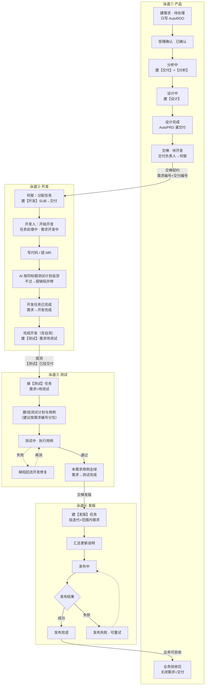
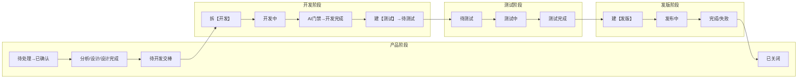
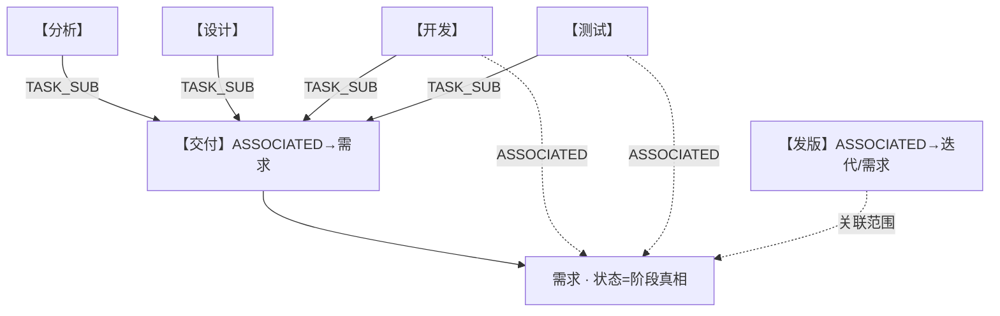

# 四角色泳道图：产品 · 开发 · 测试 · 发版

> 用途：一张图看清从建需求到发版关闭，四条泳道各自做什么、在哪交棒。  
> 依据：产品部流转 · 开发侧草案 · 生产线手册（测试/发版）  
> 日期：2026-07-24  
> 说明：开发泳道含「AI 用例门禁」草案；测试泳道为正式提测后的人/计划执行。

---

## 1. 泳道总览（推荐主图）

---

## 2. 横向时间轴版（谁在哪一阶段动）

从左到右是需求状态主链；上下是四个角色。空格表示该角色此阶段无主动动作。

---

## 3. 交接点一览

| # | 从 → 到 | 交出什么 | 需求状态落点 |
|---|---|---|---|
| 1 | 产品 → 开发 | 需求编号 +【交付】编号；交付负责人=何斐 | **待开发** |
| 2 | 开发 → 测试 | 【测试】任务（子项挂交付）；用例计划可先备好 | **待测试** |
| 3 | 测试 → 发版 | 本需求用例全绿；范围内需求清单 | **测试完成** |
| 4 | 发版 → 产品 | 发布完成证据 / 更新说明 | **发布完成** → 产品关单 **已关闭** |

---

## 4. 各泳道职责边界（一句话）

| 角色 | 管什么 | 不管什么 |
|---|---|---|
| **产品** | 建需求、【交付】【分析】【设计】、AutoPRD、交棒待开发、验收关闭 | 不建【开发】【测试】【发版】、不开分支 |
| **开发** | 拆【开发】、写码、AI 自测门禁、建【测试】提测 | 不改写产品 AutoRDO；不建第二套【交付】 |
| **测试** | 接【测试】、跑计划用例、缺陷回流、判测试完成 | 不擅自改需求状态到开发中；不建【发版】（可催） |
| **发版** | 建【发版】、挂迭代与范围、发布与回写成败 | 不替代测试判绿；不关闭需求（交给产品） |

---

## 5. 云效工作项树（跨角色）

---

## 6. 典型负责人（手册约定，可按项目改）

| 泳道 | 典型对接人 |
|---|---|
| 产品 | 王冕 · YunxiaoPM / AI |
| 开发 | 何斐（拆任务）→ 王雨昊 / 李振等（执行） |
| 测试 | 谢佳伟 |
| 发版 | 时生亮 |

---

## 相关文档

| 文档 | 说明 |
|---|---|
| `docs-全流程分步说明.md` | **整条链路逐步说明（推荐先读）** |
| `docs-产品部流转流程图.md` | 产品 0→5 细图 |
| `docs-开发侧流转草案.md` | 开发 D1–D5 细图 |
| `yunxiao-pipeline-handbook` | 全链路配置与规则 |
