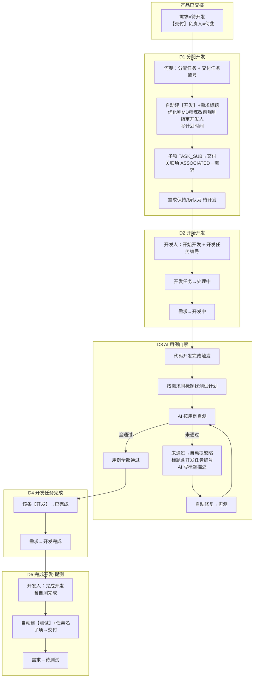
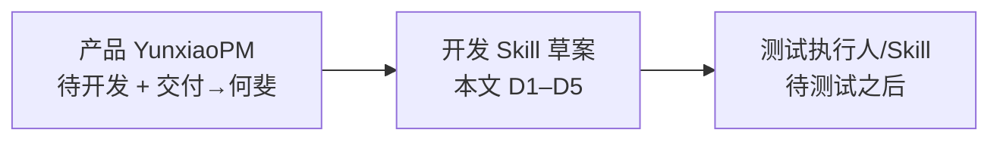

# 开发侧流转草案（产品交棒之后）

> 来源：产品经理口述规则整理（2026-07-24）  
> 上游终点：产品部 `docs-产品部流转流程图.md` → 需求=**待开发**，【交付】负责人=**何斐**  
> 本文件目标：把「何斐拆任务 → 开发执行 → AI 用例门禁 → 提测」画清，供正式 **yunxiao-development-delivery** Skill 维护
> 状态：**草案**（文末有待拍板项）

---

## 1. 总览流程图



---

## 2. 分步说明（按你的 5 条）

### D1｜何斐分配任务

| 项 | 规则 |
|---|---|
| 触发 | Skill 口令：`分配任务` + **交付任务编号** |
| 新建 | 【开发】任务；标题 = `【开发】` + **需求标题** |
| 描述 | **仅【优化】**：按需求 MD 精炼，**只写修改前规则**（见 [references/dev-task-description.md](references/dev-task-description.md)）；**【新增】不适用**；一律禁止贴 MD/PRD 全文；类型前缀只有新增/优化 |
| 负责人 | 口令指定开发人员 |
| 计划时间 | **自动创建**计划开始/计划完成（算法待定：阶段日历工时 or 人力预估，见待拍板） |
| 关联 | **子项** `TASK_SUB` →【交付】；**关联项** `ASSOCIATED` → 需求 |
| 需求状态 | 改为 / 确认为 **待开发**（见待拍板：与产品交棒是否重复） |

### D2｜开始开发

| 项 | 规则 |
|---|---|
| 触发 | `开始开发` + **开发任务编号** |
| 开发任务 | → **处理中** |
| 需求 | → **开发中**（有 ≥1 条开发进入处理中即可，或本条触发即改，见待拍板） |

### D3｜代码完成后 · AI 按测试计划自测

| 项 | 规则 |
|---|---|
| 触发 | 「代码开发完成」（MR 合并 / 口令 / Webhook，触发源待定） |
| 找计划 | **自动寻找与需求同标题的测试计划** |
| 执行 | AI 按该计划中用例自行测试 |
| 失败 | 自动提缺陷：标题含 **开发任务编号** + AI 生成标题/描述；再自动修复，循环直到用例全过 |

### D4｜用例全通过

| 项 | 规则 |
|---|---|
| 该条【开发】 | → **已完成** |
| 需求 | → **开发完成** |

### D5｜开发人「完成开发」（自测也完成）

| 项 | 规则 |
|---|---|
| 触发 | `完成开发` +（建议带）开发任务编号 |
| 新建 | 【测试】任务；标题 = `【测试】` + 任务名称（建议=需求标题） |
| 关联 | 子项 →【交付】（建议同时 ASSOCIATED→需求） |
| 需求 | → **待测试** |

---

## 3. 与产品部的衔接



| 上游已具备 | 开发侧依赖 |
|---|---|
| 需求编号 +【交付】编号 | D1 入口只认编号，不按标题拆第二套交付 |
| 交付 ASSOCIATED→需求 | D1 开发任务再 ASSOCIATED→需求、SUB→交付 |
| 产品不建【开发】【测试】 | 仅开发 Skill 建这两类 |

---

## 4. 待拍板（建议你先定这几条）

### 4.1 状态顺序是否自洽

你现在的顺序是：

```text
D3 AI 用例全过 → 开发任务已完成 + 需求「开发完成」
D5 完成开发 → 建【测试】+ 需求「待测试」
```

与现有手册常见顺序对比：

```text
手册常见：开发人完成自测 → 待测试 →（测试执行）→ 测试完成
你草案：  AI 先跑测试计划用例过关 → 开发完成 → 人再点完成开发 → 待测试
```

需要确认：
1. D3 的「测试计划」是 **开发自测门禁**，正式【测试】任务仍留给谢佳伟？  
2. 还是 D3 已等同正式测试，那 D5 再建【测试】是否重复？

### 4.2 「需求→待开发」写在 D1

产品交棒时需求**已经是待开发**。D1 再改一次通常多余。建议改为：
- D1 **校验**需求已是待开发；若不是则停下或只允许从设计完成快轨补交棒  
- 有开发任务进入处理中时，需求才变为 **开发中**（即你的 D2）

### 4.3 「与需求同标题的测试计划」

标题易改、易撞名。更稳的是：
- 测试计划关联 **需求编号 / 迭代**，或  
- 用例包命名 `CP-{需求编号}-…`  

否则同名需求/改标题会导致找错计划。

### 4.4 AI 自动提缺陷并自动修复

风险高：无上限循环、误报、改回旧逻辑。建议门禁：
- 最多 N 轮；失败转人工  
- 缺陷必须关联 **开发任务编号 + 需求编号 + 用例 ID**  
- 与「防回归」清单联动，禁止静默改无关模块  

### 4.5 多条【开发】时需求状态

| 场景 | 建议 |
|---|---|
| 任一条开始开发 | 需求 → 开发中 |
| 需求 → 开发完成 | **全部**未取消【开发】均为已完成（与手册 Y21 一致） |
| 需求 → 待测试 | 全部【开发】完成后，由末位「完成开发」或系统自动建【测试】 |

你原文 D4 写「该条」通过就把需求改成开发完成——多开发人并行时会过早。建议改成「全员开发任务完成」。

### 4.6 关联写法（与产品侧一致）

同一 create 只能带一条 `createWorkitemRelationInfo`：
- 优先保证【开发】/【测试】**子项挂在交付**（交付详情「子项」可见）  
- ASSOCIATED→需求若同 create 互斥，需约定：先 SUB，再补 ASSOCIATED，或 OpenAPI 双挂  

---

## 5. 建议口令面（草案）

```text
分配任务：交付任务=ONEOS-a；开发人=张三,李四；计划开始=…；计划完成=…
开始开发：开发任务=ONEOS-d
代码完成：开发任务=ONEOS-d          → 触发 AI 用例门禁（或 Webhook）
完成开发：开发任务=ONEOS-d          → 建【测试】；需求→待测试
```

---

## 6. 推荐定稿后的状态主链（供你勾选）

**方案 A（贴近你原文，AI 测作开发门禁）**

```text
待开发 → 开发中 →（AI 用例门禁）→ 开发完成 → 待测试 → 测试中 → 测试完成 → …
```

**方案 B（贴近现有生产线手册）**

```text
待开发 → 开发中 → 开发完成（人自测+MR）→ 待测试 → 测试中（人/AI 跑计划）→ 测试完成 → …
```

AI 跑测试计划放在 **待测试之后**，与【测试】任务负责人（如谢佳伟）对齐。

---

## 7. 下一步

1. 你拍板：**方案 A 或 B**，以及多【开发】时「开发完成 / 待测试」的聚合规则  
2. 我按定稿维护 `yunxiao-development-delivery` 的 `SKILL.md` + 与产品交棒契约对齐段落
3. 再补一版「仅开发侧」验收清单（10 条以内）

---

## 相关文档

| 文档 | 路径 |
|---|---|
| 产品部流转 | `docs-产品部流转流程图.md` |
| 产品↔开发契约 | `docs-YunxiaoPM-实现原理-开发Skill对接.md` |
| 全链路手册 | `src/prototypes/yunxiao-pipeline-handbook/` |
