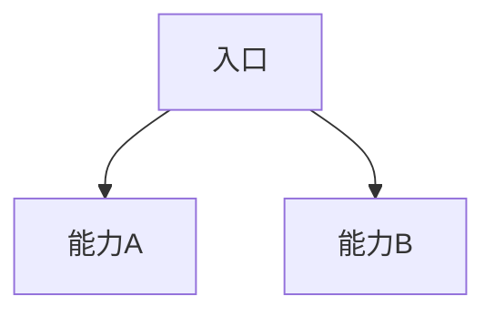

# OneOS AutoPRD 输出模板

复制下列结构填写。方括号为占位。**第 4 章用户故事必须用业务条线说明口径。**

```markdown
# <模块名> · 产品需求说明（全模块）

## 1. 一句话与目标

**一句话**  
<用一句话说明模块解决什么>

**要解决的问题**  
- …

**本期目标**  
1. …
2. …

**非目标（本期不做）**  
- …

## 2. 模块边界（最重要）

（可选 mermaid：模块与外部系统关系）

| 业务线 / 子域 | 做什么 | 不做什么 |
|---------------|--------|----------|
| … | … | … |

**外部依赖（产品口径）**  
| 依赖方 | 交互方式 | 产品要求 |
|--------|----------|----------|
| … | … | … |

**关键约束**  
- …

## 3. 用户与角色

| 角色 | 主要目标 |
|------|----------|
| … | … |

> 角色名优先与「业务条线说明」一致（如业务管理组、采购部、运维部）。

## 4. 用户故事与故事点（业务条线说明口径）

> 故事点 / 规模供排期参考，可按团队基准调整。合计约 **N SP**（或 S/M/L 汇总说明）。

按 Epic 或能力单元分组。**每一条**按下面四块写（对齐业务条线说明页：责任部门 → 起点 → 怎么运作 → 闭环）：

### Epic A · <名称>（约 N SP）

#### A1 · <能力标题>
- **角色**：…
- **起点**：…
- **怎么运作**：
  1. …
  2. …
  3. …
- **关键结果**（可选）：`可…` / `禁止…`
- **闭环**：…
- **排期（可选）**：US-xx · 规模 S/M/L · 「作为…，我想…，以便…」

#### A2 · <能力标题>
…

### Epic B · …

## 5. 功能模块说明（正向 / 逆向）

### 5.x <功能名>

**正向**  
1. …  
2. …  

**逆向 / 边界**  

| 情况 | 系统表现 |
|------|----------|
| … | … |

## 6. 关键业务逻辑（必须对齐）

### 6.x <规则名>

用编号优先级、表格或短列表写清业务规则。

## 7. 总览流程图



## 8. 验收清单（产品 / 测试）

**子域 A**  
- [ ] …  

## 9. 交付口径

> <一段可贴需求单开头的浓缩描述>

## 10. 功能变更记录

> 产品经理原型发版记录。仅记功能与业务逻辑变更；不含样式/UI/表结构。  
> 由「需求定稿」关键字触发追加；日常改原型不强制每改必写。详见 [release-changelog.md](release-changelog.md)。

### 定稿 · YYYY-MM-DD

- 「<能力名>」：<做了什么 / 逻辑如何变>
- …
```

成文后**必须**同步 Axhub 标注目录（见 [annotation-sync.md](annotation-sync.md)）：

1. `src/prototypes/<id>/.spec/requirements-prd.md`
2. `annotation-source.json` → 目录节点「产品需求说明（PRD）」（`markdownPath` + `markdown`）
3. `src/resources/prd/<id>-autoprd.md`
4. 定稿时另写：`src/prototypes/<id>/.spec/autoprd-baseline.json`

## 用户故事写法（对照业务条线说明）

业务条线说明页字段 → AutoPRD 字段：

| 页面 | AutoPRD |
|------|---------|
| 责任部门标签 | **角色** |
| 起点 | **起点** |
| 怎么运作（有序列表） | **怎么运作** |
| 结果色签 | **关键结果**（可选） |
| 闭环 | **闭环** |

示例口吻（摘自业务条线风格，非照抄某模块）：

- **起点**：采购部维护交强与商业险台账，作为交车合规的前置数据。  
- **怎么运作**：1. 运营录入或识别保单… 2. 运维交车时校验…  
- **闭环**：核心险种有效则允许交车；异常则拦截并提示原因，过程可追溯。

**不要**用下面这种宽表作为第 4 章唯一形态：

| 编号 | 作为…我希望… | SP |
|------|--------------|----|

「作为…我想…以便…」只允许作为**排期可选一行**，主叙述必须是起点/怎么运作/闭环。

## 正逆向写法约定

- **正向**：用户成功完成任务的最短路径  
- **逆向**：取消、关闭、禁用、冲突状态、不可操作项  
- 审批类：写清「本页只读 / 在外部系统办理」  

## 规模与故事点

| 规模 | 建议含义 | 约 SP |
|------|----------|-------|
| S | 轻交互 / 列表展示 | 1～2 |
| M | 标准流程 + 筛选详情 | 3～5 |
| L | 状态机 / 跨模块 / 批量识别 | 6+ |
